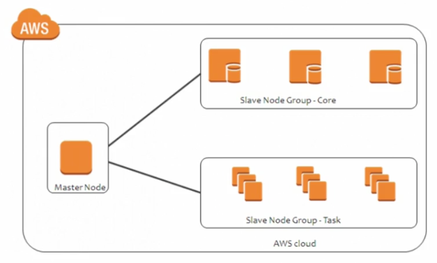

# Designing for Operation Excellence

## Web App Firewall (WAF)
- HTTP/HTTPS Firewall
    - AKA layer 7 FW
- Errors with be HTTP 403 (forbidden)
- config default behavior
    - what happens when a request doesn't match rules?
        - allow or deny?
- Are people going to access this from the internet? Use a WAF
- Internal, use ACL or Sec Groups

## Simple Queue Service (SQS)
- used to decouple apps
- queued and processed async
    - non linear
    - can be in ordered if required
- 256 KB limit
- send the pointers and info needed for the next process
- message producer
    - put message in queue
- message consumer
    - does something with the message
- Redundant across multi AZs
- Queued until processed up to 14 days by default
- **AUTO SCALE**
- SQS Types
    - Standard
        - defaults
        - async
    - FIFO
        - guarantees sync delivery
        - support fewer transactions per second because of overhead

## Simple Notification Service (SNS)
- paging in the cloud
- topics
  - publishers push messages to clients
- subscribers
  - receive all messages broadcasted to the topic
- stored across multiple AZs
- 256 KB limit
- SMS limit is 140 bytes

## Simple Workflow (SWF)
- define the sequence of events to finish
- decoupled apps
- operates in a domain
- one invocation per activity, can be invoke multiple times
- workers
  - do the work tasked
  
## Step Functions
- replacement for SWF
- uses state machines:
  - Decider
  - Activity task
  - Work task
- flow in parallel concurrently

# Designing for Elasticity and Scalability

## OpsWork
- management tools
- implement a config management service
- code based
  - instance, service, app deploy
- operate
  - app and infra updates
- **AUTO DEPLOY**
  
### OpsWorks Stack
- initial mode
- collection of layers (ex: LAMP)
    - any AWS or RT environment
  
### OpWorks Chef Automate
- cookbooks contain recipes
- recipes = layers
  - define settings

### OpWorks Puppet
- Master servers
  - modules = layers

- In the Cloud
  - Chef
  - Puppet
- On the Prem
  - Stacks

## Cognito
- SSO

## Elastic MapReduce (EMR)

### Intro
- reduce the load my mapping processes to processing
- distributes processing across cluster
  - Hadoop framework
- pulls from S3 and EC2 to process
- massive amounts of data
  
### EMR Cluster Nodes
- Master
  - coordinates jobs
- Core
  - run tasks assigned by master
  - store data in cluster
- Task
  - only runs task
  - NOT storing

## CloudFormation
- roll out many many instances with one design template
- template in deployment = stack
- mirroring existing architectures

## CloudWatch
- monitor critical systems
- push on prem logs
- take automatic actions
  
## Trusted Advisor
- helps you with recommendations

## Organizations
- lets you manage multiple AWS accounts
- can apply policies to each account